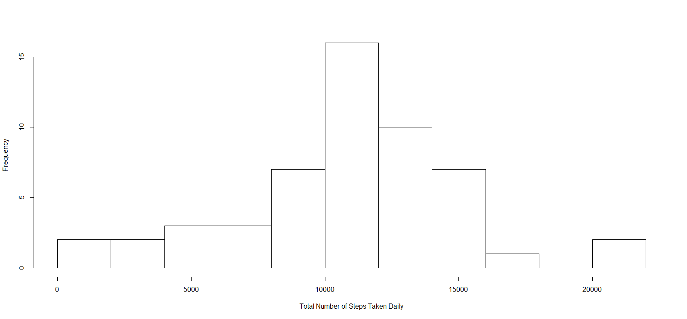
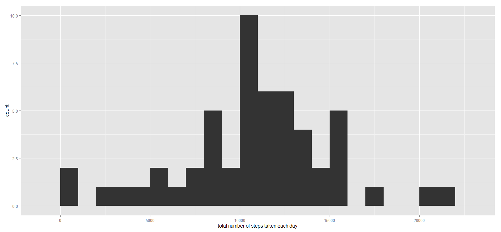
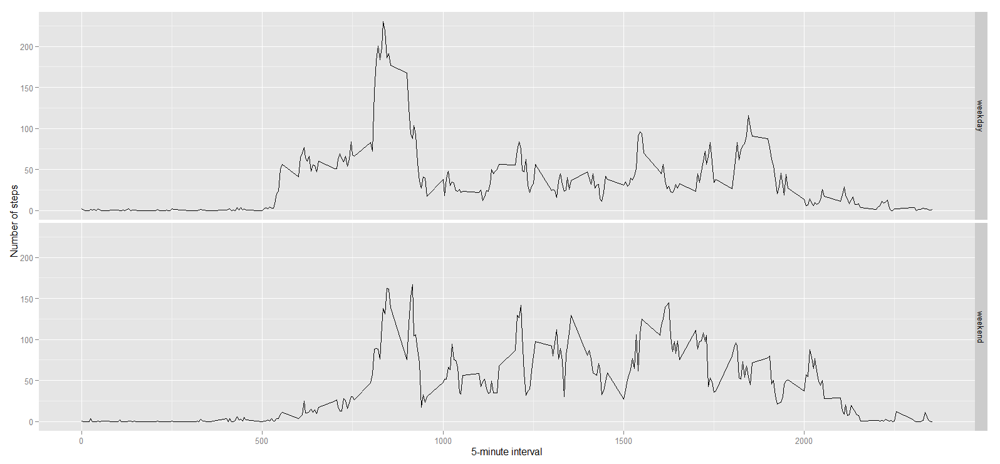

# Reproducible Research: Peer Assessment 1

## Loading and preprocessing the data

Load input data from a zip file from the current R working directory.

```r
unzip(zipfile = "activity.zip")
data <- read.csv("activity.csv")
# convert date to date data type
data$date <- as.Date(data$date) 
```


## What is mean total number of steps taken per day?

Create a new dataset ignoring missing data NA
Plot a histogram of the total number of steps taken each day
Report the mean and median total number of steps taken per day

```r
data.ignore.na <- na.omit(data) 

# sum steps by date
daily.steps <- rowsum(data.ignore.na$steps, format(data.ignore.na$date, '%Y-%m-%d')) 
daily.steps <- data.frame(daily.steps) 
names(daily.steps) <- ("steps") 

# Plot histogram of the total number of steps taken each day:

hist(daily.steps$steps, 
     main=" ",
     breaks=10,
     xlab="Total Number of Steps Taken Daily")
```

 

Report mean and median of steps:


```r
total.steps<-daily.steps$steps
mean(total.steps, na.rm = TRUE)
```

```
## [1] 10766.19

```

```r
median(total.steps, na.rm = TRUE)
```

```
## [1] 10765
```


## What is the average daily activity pattern?

- Calculate average steps for each of 5-minute interval during a 24-hour period.
- Make a time series plot (i.e. type = “l”) of the 5-minute interval (x-axis) and the average number of steps taken, averaged across all days (y-axis)
- Report which 5-minute interval, on average across all the days in the dataset, contains the maximum number of steps?
- Observer and comment the average daily activity pattern

```r
library(plyr)

# Calculate average steps for each of 5-minute interval during a 24-hour period
interval.mean.steps <- ddply(data.ignore.na,~interval, summarise, mean=mean(steps))

library(ggplot2)
qplot(x=interval, y=mean, data = interval.mean.steps,  geom = "line",
      xlab="5-Minute Interval (military time)",
      ylab="Number of Step Count",
      main="Average Number of Steps Taken Averaged Across All Days"
      )
```

 


On average across all the days in the dataset, the 5-minute interval contains
the maximum number of steps?

```r
interval.mean.steps[which.max(interval.mean.steps$mean), ]
```

```
##     interval steps
## 104      835 206.1698
```


## Imputing missing values

There are many days/intervals where there are missing values (coded as `NA`). The presence of missing days may introduce bias into some calculations or summaries of the data.

- Calculate and report the total number of missing values in the dataset (i.e. the total number of rows with NAs)
- Implement a strategy for filling in all of the missing values in the dataset. For this assignment the strategy is to use the mean for that 5-minute interval to replace missing valuse. Create a new dataset that is equal to the original dataset but with the missing data filled in.
- Make a histogram of the total number of steps taken each day
Calculate and report the mean and median total number of steps taken per day.
- Make following comments: Do these values differ from the estimates from the first part of the assignment? What is the impact of imputing missing data on the estimates of the total daily number of steps?

```r
missing <- is.na(data$steps)
# How many missing
table(missing)
```

```
## missing
## FALSE  TRUE 
## 15264  2304
```


All of the missing values are filled in with mean value for that 5-minute
interval.


```r
# Replace each missing value with the mean value of its 5-minute interval
fill.value <- function(steps, interval) {
    filled <- NA
    if (!is.na(steps)) 
        filled <- c(steps) else filled <- (averages[averages$interval == interval, "steps"])
    return(filled)
}
filled.data <- data
filled.data$steps <- mapply(fill.value, filled.data$steps, filled.data$interval)
```

Now, using the filled data set, let's make a histogram of the total number of steps taken each day and calculate the mean and median total number of steps.


```r
total.steps <- tapply(filled.data$steps, filled.data$date, FUN = sum)
qplot(total.steps, binwidth = 1000, xlab = "total number of steps taken each day")
```

 

```r
mean(total.steps)
```

```
## [1] 10766.19
```

```r
median(total.steps)
```

```
## [1] 10766
```


Mean and median values are higher after imputing missing data. The reason is
that in the original data, there are some days with `steps` values `NA` for 
any `interval`. The total number of steps taken in such days are set to 0s by
default. However, after replacing missing `steps` values with the mean `steps`
of associated `interval` value, these 0 values are removed from the histogram
of total number of steps taken each day.

## Are there differences in activity patterns between weekdays and weekends?
First, let's find the day of the week for each measurement in the dataset. In
this part, we use the dataset with the filled-in values.


```r
weekday.or.weekend <- function(date) {
    day <- weekdays(date)
    if (day %in% c("Monday", "Tuesday", "Wednesday", "Thursday", "Friday")) 
        return("weekday") else if (day %in% c("Saturday", "Sunday")) 
        return("weekend") else stop("invalid date")
}
filled.data$date <- as.Date(filled.data$date)
filled.data$day <- sapply(filled.data$date, FUN = weekday.or.weekend)
```


Now, let's make a panel plot containing plots of average number of steps taken
on weekdays and weekends.

```r
averages <- aggregate(steps ~ interval + day, data = filled.data, mean)
ggplot(averages, aes(interval, steps)) + geom_line() + facet_grid(day ~ .) + 
    xlab("5-minute interval") + ylab("Number of steps")
```

 
